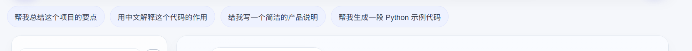

# AI Demo — 本地 AI 对话演示应用

这是一个基于浏览器的 AI 聊天 Demo，前后端分离，前端负责交互和 UI，后端负责与 OpenAI 兼容 API 通信，并提供静态资源托管。

## 功能亮点

- 多会话聊天：支持多个对话列表、切换、删除、重命名、置顶等
- Markdown 渲染：AI 回复支持 Markdown、代码高亮、列表和引用等排版
- 文件上传：支持上传文本类文件，并将内容作为上下文传入模型
- 流式输出：AI 回复逐段返回，体验更接近真实对话
- 语音输入：支持浏览器语音识别
- 语音播报：支持 AI 回复朗读
- 会话记忆：保留最近上下文与摘要，提升连续对话体验
- 本地持久化：多会话状态和用户配置保存在浏览器 localStorage

## 项目结构

- `client/public/`：前端静态页面和样式脚本
  - `index.html`：应用入口结构
  - `main.js`：页面逻辑、会话状态、流式聊天、头像、侧边栏等
  - `style.css`：UI 样式
- `server/`：Express 后端
  - `index.js`：接口实现、会话上下文构造、模型调用、静态文件托管
  - `.env.example`：环境变量示例
  - `package.json`：后端依赖和脚本入口
- `README.md`：项目说明
- `.gitignore`：Git 忽略规则

## 项目预览



## 技术栈

- 前端：静态 HTML/CSS/JavaScript
- 后端：Node.js + Express
- AI API：OpenAI 兼容的聊天接口
- 渲染：Marked + DOMPurify + Highlight.js
- 持久化：localStorage

## 环境要求

- Node.js 18+
- 一个可访问的 OpenAI 兼容 API 服务
- 可用的 `OPENAI_API_KEY` 或对应模型访问凭证

## 快速开始

1. 进入后端目录：
   ```bash
   cd server
   ```

2. 安装依赖：
   ```bash
   npm install
   ```

3. 复制环境变量示例：
   ```bash
   copy .env.example .env
   ```

4. 编辑 `.env`，填入你的 API 配置，例如：
   ```env
   PORT=3000
   OPENAI_API_KEY=your_api_key_here
   OPENAI_BASE_URL=https://api.openai.com/v1
   OPENAI_MODEL=gpt-4o-mini
   ```

   如果你的服务不是 OpenAI 官方 API，也可以根据实际情况调整 `OPENAI_BASE_URL` 和 `OPENAI_MODEL`。

5. 启动项目：
   ```bash
   npm run dev
   ```

6. 打开浏览器访问：
   ```text
   http://localhost:3000
   ```

## API 说明

后端提供以下接口：

- `GET /api/health`：服务健康检查
- `GET /api/models`：获取可用模型列表
- `POST /api/normalize`：语音文本规范化和意图识别
- `POST /api/chat`：发送聊天消息并返回流式 AI 回复

## 注意事项

- `.env` 文件已被 Git 忽略，不会上传到仓库。
- 当前项目是本地演示型应用，主要目标是展示 AI 产品交互体验；并未接入完整用户系统和数据库。
- 大部分状态保存在浏览器本地，因此清除浏览器缓存/本地存储后会丢失会话数据。

## 许可

该项目仅用于演示和学习用途，具体使用方式以实际部署环境和第三方 API 服务条款为准。